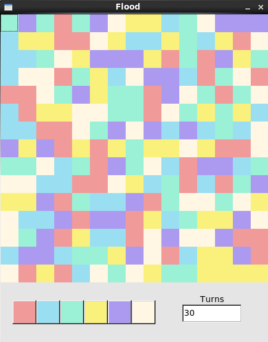

  

<h1 align="center"Flood-It</h1>

  </a>

A flood fill game written in Python 2.7 with FLTK.

## Gameplay
The game begin with control over the top right box. When the colour buttons at the bottom of the window are clicked,
all surrounding buttons of the same colour change colour.

The objective of the game is to have one uniform button colour executed below the recommended amount of turns.

## Usage : python flood-it.py

For best results, please ensure Python 2.7 and the FLTK toolkit are installed on your device
FLTK can be easily installed on Centos and Ubuntu with the command: sudo apt-get python-fltk
